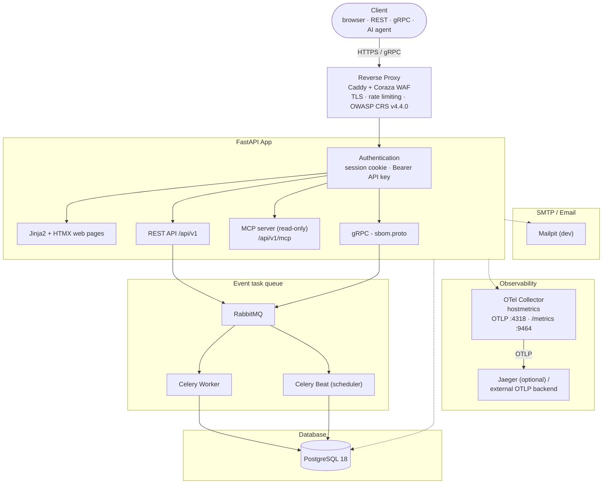
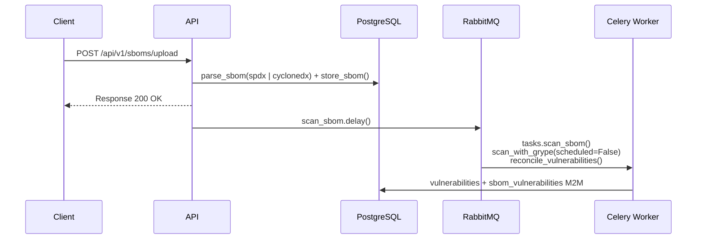
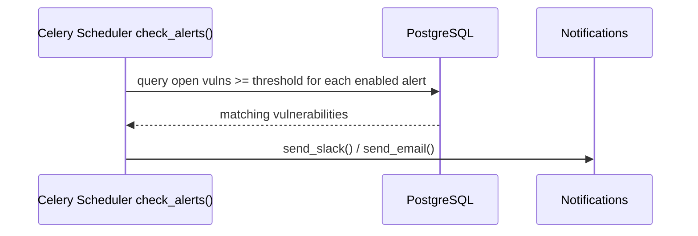

# Architecture

## Overview

Argus SBOM Guard is an async-first Python web application for managing
Software Bill of Materials (SBOMs) and tracking vulnerabilities.

## Stack

| Component | Technology |
|-----------|------------|
| Web framework | FastAPI (uvicorn) |
| Reverse proxy | Caddy + Coraza WAF (OWASP CRS v4.4.0) |
| Database | PostgreSQL 18 |
| DB driver | asyncpg (async) |
| ORM | SQLAlchemy 2.0 (async session) |
| Task queue | Celery + RabbitMQ |
| Frontend | HTMX + Jinja2 + Alpine.js + DaisyUI 5 + Tailwind CSS v4 |
| Auth | Passwordless email login + signed cookies |
| gRPC | grpcio + protobuf |
| AI agents | Read-only MCP server (`/api/v1/mcp`) |
| Vuln scanner | Grype CLI + OSV API |
| Observability | OpenTelemetry Collector (hostmetrics + OTLP) |

## Service Architecture



All inbound traffic is authenticated before reaching a handler, against the same
two credentials: the signed **session cookie** for the web UI and an
**`Authorization: Bearer` API key** for programmatic access. HTTP requests pass
through the Starlette middleware stack (`TrustedHost` → `AuthMiddleware`), which
enforces the session cookie for the HTML pages (redirecting to `/login` when
missing) while letting `/api/*` through; REST routes then authenticate per
request via the `api_key_required` dependency (session cookie or Bearer), and the
MCP endpoint is wrapped in its own `MCPAuthMiddleware` (Bearer only). The gRPC
server on `:50051` runs in the same app process (started from the FastAPI
lifespan) but outside the ASGI middleware stack, enforcing the same Bearer API
key through its own `AuthInterceptor`.

The proxy terminates TLS and splits the traffic: HTTP requests are inspected by
rate limiting and the OWASP CRS rules before reaching `app:8000`, while gRPC uses
a dedicated route (`h2c://app:50051`) that bypasses the WAF and rate limiting.
Both the REST/gRPC APIs and the read-only MCP endpoint for AI agents are served
by the same FastAPI process. The OTel Collector sits
alongside the stack as the observability hub: it scrapes `hostmetrics` from the
host filesystem (`/hostfs`), exposes `GET /metrics` through Caddy, receives
optional OTLP traces from the app, and can forward to an arbitrary OTLP backend.
See [Reverse Proxy + WAF](../guide/proxy.md) and
[Observability](../guide/observability.md).

## Request Flow

### SBOM Upload & Scan



### Alert Flow



## Data Model

14 tables, organized into these domains:

```
users ──► api_keys
users ──► login_tokens

projects ──► services ──► sboms ──► dependencies
                          sboms ──► sbom_vulnerabilities ◄── vulnerabilities
projects ──► vulnerability_snapshots
projects ──► alert_rules ──► notifications
projects ──► risk_acceptances ◄── vulnerabilities
projects ──► pull_requests
```

### Key Tables

| Table | Purpose |
|-------|---------|
| `projects` | Top-level grouping |
| `services` | Microservices/containers within a project |
| `sboms` | Uploaded SBOMs with `raw_sbom` (JSONB) |
| `dependencies` | Parsed dependencies from each SBOM |
| `vulnerabilities` | CVE data with severity, CVSS, affected packages |
| `sbom_vulnerabilities` | M:N join with status (open/fixed) |
| `vulnerability_snapshots` | Daily per-project metrics |
| `risk_acceptances` | Per-project/service "won't fix" decisions on a vulnerability |
| `alert_rules` | Alert rules with severity threshold |
| `notifications` | Sent notification history |
| `api_keys` | API keys for programmatic access |
| `login_tokens` | One-time codes for email login |
| `pull_requests` | Dependency update PR tracking |

## Directory Layout

```
app/api/          FastAPI routers (one module per resource)
app/services/     Business logic + Celery tasks
app/models/       SQLAlchemy ORM models
app/middleware/    Auth stack (cookie + API key)
app/templates/    Jinja2 templates + partials (HTMX)
app/static/       CSS, images
app/migrations/   Alembic migrations
app/tests/        pytest tests
```

## Configuration

All settings are defined in `app/config.py` using `pydantic-settings`, loaded from
`.env`. Settings include database connection, RabbitMQ broker, SMTP, Slack webhook,
and auth parameters.

## Async & Celery

- **All DB access is async** via `AsyncSession` and `asyncpg`
- **Blocking operations** (Grype scanning, vulnerability processing) run in Celery workers
- **Periodic tasks** (alert checking, snapshot creation, vulnerability rescan of the latest SBOMs) run via Celery Beat
- Workers use `NullPool` to avoid connection pinning across greenlets
