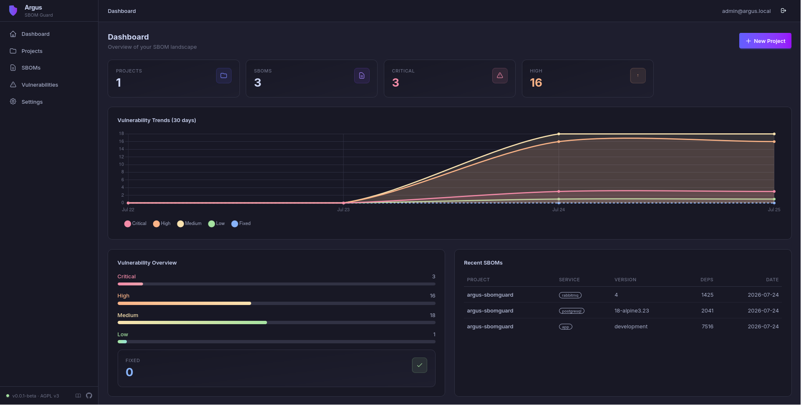

# Argus SBOM Guard

**Open-source SBOM-based vulnerability management platform.**

Import CycloneDX/SPDX SBOMs, scan dependencies with Grype and OSV, track vulnerabilities over time, and monitor your software supply chain risk.

*Centralized SBOM management. On-prem, deploy anywhere.*

## Quick Start

```bash
cp .env.example .env
docker compose up -d
docker compose exec app alembic upgrade head
```

Open [http://localhost:8000](http://localhost:8000), log in with `admin@argus.local`,
and grab the one-time code from [Mailpit](http://localhost:8025) (dev only) — or set
`SHOW_LOGIN_CODE_IN_RESPONSE=true` to display it directly on the login page.

> Running this on a server? Follow the [Deployment Guide](deployment.md) for a
> copy-paste walkthrough covering hardware requirements, TLS, and production
> configuration.

## Features

- **SBOM Management** — Upload, store, and diff CycloneDX & SPDX SBOMs
- **Vulnerability Scanning** — Automatic analysis via Grype + OSV API
- **Vulnerability Tracking** — CVE status, severity, open/fixed reconciliation, historical trends
- **Alerting** — Slack and email notifications for new vulnerabilities
- **Supply Chain Visibility** — Projects, services, dependencies, version history
- **REST API + gRPC** — Full API with key-based authentication
- **Dashboard** — Real-time trends and per-project vulnerability metrics



## Who Is This For?

- **Platform / SRE teams** tracking dependencies across microservices
- **Security engineers** monitoring vulnerability exposure over time
- **DevSecOps teams** integrating SBOM management into CI/CD
- **Open source maintainers** generating and managing SBOMs
- **Compliance teams** that need SBOM history and audit trails

## Architecture at a Glance

```
projects → services → sboms → dependencies
vulnerabilities ──M:N── sboms (via sbom_vulnerabilities)
vulnerability_snapshots (daily per-project metrics)
alert_configs → notifications
users → api_keys / login_tokens
```

| Layer | Technology |
|-------|------------|
| Backend | Python 3.12 + FastAPI + Celery + RabbitMQ |
| Frontend | HTMX + Jinja2 + Alpine.js + DaisyUI 5 + Tailwind CSS v4 |
| Database | PostgreSQL 18 + asyncpg |
| Vuln Scanner | Grype + OSV API |
| Auth | Passwordless email login + API keys |

---

**Ready to get started?** [Deployment Guide →](deployment.md) · [Setup →](setup.md) · [User Guide →](guide/projects.md) · [API Reference →](api/reference.md)
